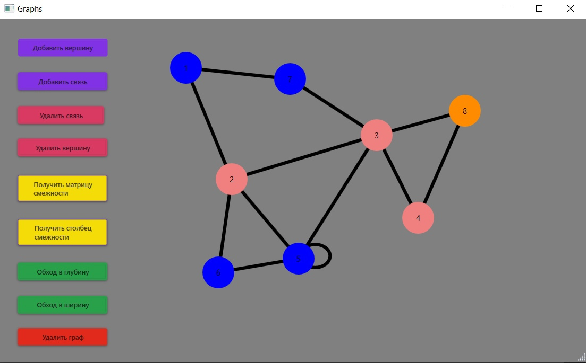

### Приложение по работе с графами

Данное приложение предоставляет возможность визуализации неориенитрованных графов, а также алгоритмов обхода в ширину и в глубину

Доступные функции:
1) Добавление вершины в месте клика мыши
2) Добавление ребра между двумя выбранными вершинами
3) Удаление выбранной вершины
4) Удаление ребра между двумя выбранными вершинами
5) Получение матрицы смежности
6) Получение столбца смежности
7) Анимация обхода в глубину
8) Анимация обхода в ширину  
9) Удаление графа (очищение формы)

    

        
    

 

    

        
    

